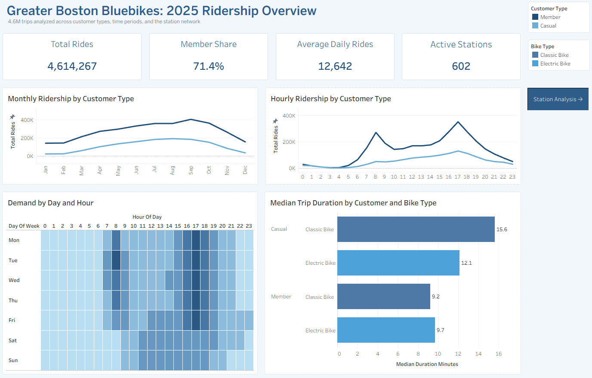
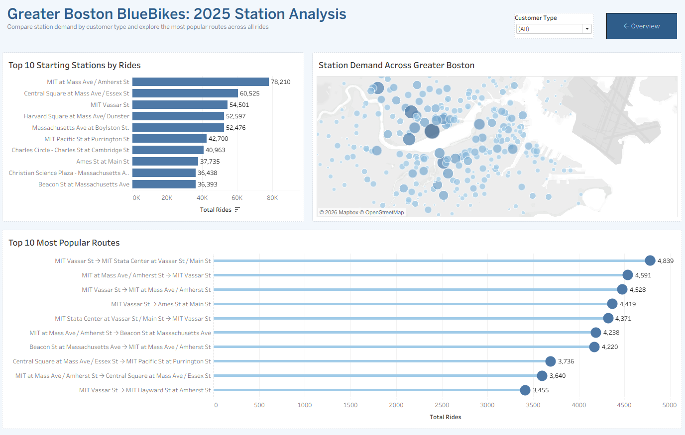

# Greater Boston Bluebikes: 2025 Ridership Analysis

SQL analysis and Tableau dashboards based on Greater Boston Bluebikes trip data from 2025.

**[View the interactive dashboard on Tableau Public](https://public.tableau.com/views/Bluebikes_2025_Dashboard/01Overview?:language=en-US&:sid=&:redirect=auth&:display_count=n&:origin=viz_share_link)**

## Overview

Bluebikes publishes trip-level data each month. I combined the twelve 2025 files in PostgreSQL and analyzed how ridership changes over time, how members and casual riders use the system differently, and which stations and routes receive the most traffic. I then built two Tableau dashboards to present the results.

## Questions Explored

- When is Bluebikes demand highest during the year and throughout the day?
- How do member and casual riding patterns differ?
- Which starting stations handle the most trips?
- Where is demand concentrated across the station network?
- Which directional routes are used most often?

## Data Preparation

The dashboard contains 4,614,267 trips. Before building the visualizations, I checked ride IDs for duplicates, reviewed missing station fields, and created the time and duration fields needed for analysis.

Records with an end time earlier than or equal to the start time were excluded from trip-duration calculations only. Trips without the required station names were excluded from route-level analysis. Routes are directional, meaning Station A to Station B and Station B to Station A are counted separately.

## Dashboards

### Ridership Overview

The first dashboard summarizes total rides, member share, average daily rides, and active stations. It also shows monthly and hourly trends, demand by day and hour, and median trip duration by customer and bike type.

### Station Analysis

The second dashboard focuses on the station network. It includes the top starting stations, a map of station demand, and the most frequently traveled directional routes. The customer type filter updates the station ranking and map.

## Key Findings

- The system recorded 4,614,267 trips, or an average of 12,642 rides per day.
- Members accounted for 71.4% of total rides.
- Monthly ridership was highest in September.
- Member demand showed clear commute peaks around 8 AM and 5 PM.
- Casual riders generally took longer trips than members. Median duration ranged from 12.1 to 15.6 minutes for casual riders and from 9.2 to 9.7 minutes for members.
- MIT at Mass Ave / Amherst St was the busiest starting station, with 78,210 rides.
- The most popular directional route recorded 4,839 rides.

## Tools

- PostgreSQL and pgAdmin
- SQL
- Tableau Public
